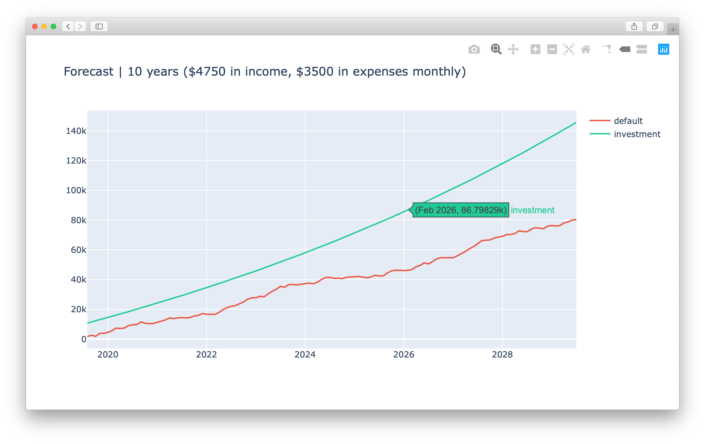

# forecast

Simulate personal finance projections with Python 3 and [Plotly](https://plot.ly/).



### Install dependencies

Install them all with [pip](https://pypi.org/project/pip/). You may need to use `pip3` for Python 3.

```
$ pip install -r requirements.txt
```

### Write configs

Each YAML file in `configs` is a snapshot of a hypothetical financial profile, and Forecast makes projections on each. See the sample config for details. 

### Run

Forecast will build a chart and a CSV for each configuration (except sample.yaml) and place these in the `output` directory.

```
$ python main.py <years> --auto-open --include-net
```

### Notes

- Be sure to keep your amounts in either _monthly_ or _yearly_ terms, consistent with the mode you choose in the config.
- Any interest is compounded on funds that exist at the beginning of the period, in the way that the [investor.gov](https://www.investor.gov/additional-resources/free-financial-planning-tools/compound-interest-calculator) calculator works.
